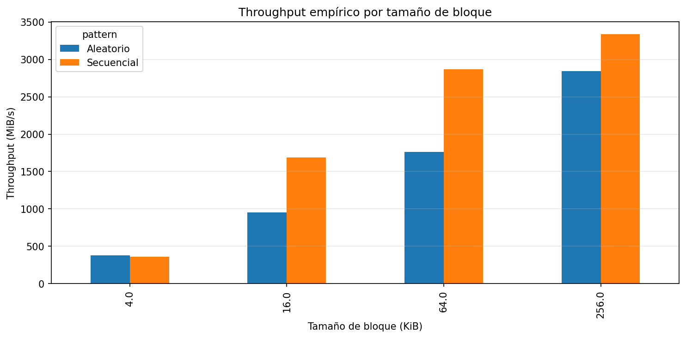
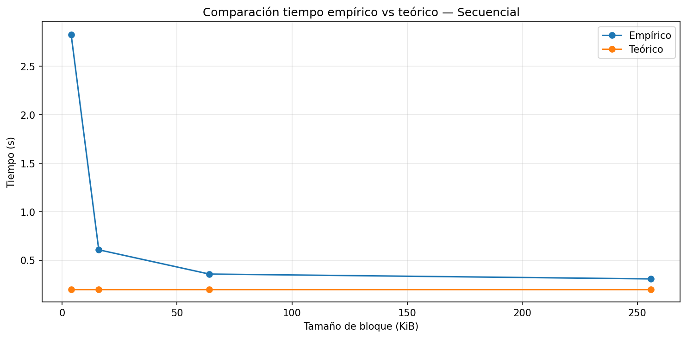
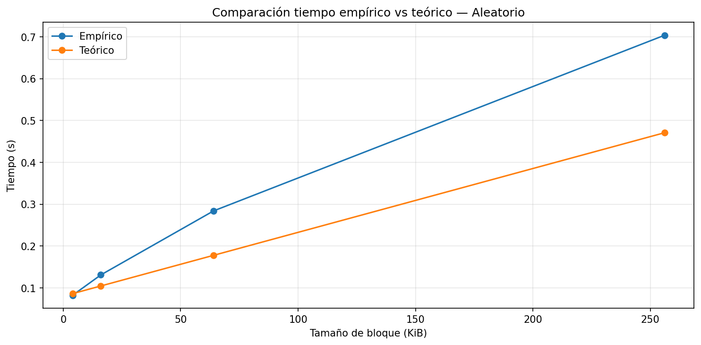
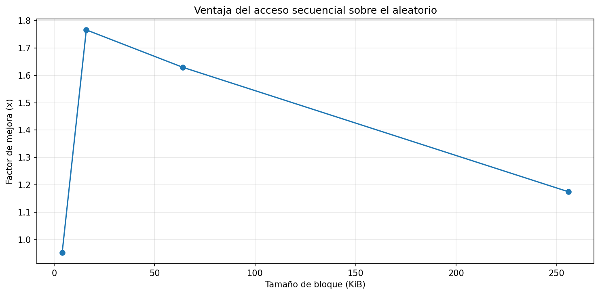

# lab3-IO_performance-BryanMedrano
Tercer laboratorio de la materia Estructura de Datos y Laboratorio.

___

### Objetivo

El objetivo de este laboratorio es analizar el rendimiento de acceso a disco comparando acceso secuencial vs aleatorio, evaluando el impacto del tamaño de bloque y contrastando los resultados empíricos con un modelo teórico de I/O.

___

### **1. Especificaciones del equipo**

| Parámetro | Valor |
|----------|------|
| **Sistema Operativo** | Windows 11 Pro 25H2 |
| **CPU (Modelo y Frecuencia)** | AMD Ryzen 5 5500U with Radeon Graphics (2.10 GHz) |
| **Arquitectura y Núcleos** | x64 / 6 núcleos  |
| **Memoria RAM Total** | 12 GB |
| **Tecnología de Almacenamiento** | SSD NVMe (INTEL SSDPEKNU512GZH) |
| **Carga de CPU en Reposo** | 1% – 2% |

___

### **2. Resultados del Experimento**

#### **Throughput por tamaño de bloque**

___

#### **Comparación teoría vs práctica (secuencial)**

___

#### **Comparación teoría vs práctica (aleatorio)**

___

#### **Ventaja del acceso secuencial**

___

### **Análisis y Conclusiones**

1. **Comparación de patrones:** Con base en sus mediciones, ¿cuántas
   veces más rápido fue el acceso secuencial respecto al aleatorio en
   su equipo? ¿Ese resultado era el esperado según la teoría?

   **R//**: En mi PC observé que el acceso secuencial fue entre 1.17x y 1.76x más rápido que el acceso aleatorio, dependiendo del tamaño de bloque. La mayor diferencia se dio con bloques de 16 KB, donde el secuencial alcanzó unos 1687 MiB/s frente a 955 MiB/s en aleatorio, es decir, aproximadamente 1.76 veces más rápido. Este resultado era el esperado según la teoría, ya que en acceso secuencial el número de accesos al disco es muy bajo ($M \approx 1$), mientras que en acceso aleatorio se hacen muchos accesos independientes, lo que incrementa el costo por la latencia acumulada.

2. **Efecto del tamaño de bloque:** ¿Qué ocurrió con el throughput del
   acceso aleatorio a medida que aumentó el tamaño de bloque?
   ¿Por qué cree que sucede eso?

   **R//:** En mis resultados, el throughput del acceso aleatorio aumentó bastante al incrementar el tamaño de bloque. Por ejemplo, pasó de aproximadamente 380 MiB/s con bloques de 4 KB a cerca de 2842 MiB/s con bloques de 256 KB. Esto sucede porque al leer bloques más grandes, en cada acceso se transfiere más información, por lo que se aprovecha mejor el disco. Según el modelo teórico, esto reduce el impacto de la latencia en el tiempo total, ya que el costo de transferencia empieza a dominar sobre el costo de acceso.

3. **Teoría vs práctica:** Identifique un caso en sus resultados donde
   la medición empírica se alejó del modelo teórico. ¿A qué factor
   atribuye esa diferencia?

   **R//:** En mis resultados, el throughput del acceso aleatorio aumentó bastante al incrementar el tamaño de bloque. Por ejemplo, pasó de aproximadamente 380 MiB/s con bloques de 4 KB a cerca de 2842 MiB/s con bloques de 256 KB. Esto sucede porque al leer bloques más grandes, en cada acceso se transfiere más información, por lo que se aprovecha mejor el disco. Yo creo que esto reduce el impacto de la latencia en el tiempo total, ya que el costo de transferencia empieza a dominar sobre el costo de acceso.

4. **Tipo de disco:** Compare sus resultados con los valores de referencia
   de la tabla de la guía. ¿Su equipo se comportó como un HDD, un SSD
   SATA o un SSD NVMe?

   **R//:** Según los resultados obtenidos en mi PC, el comportamiento corresponde  a un SSD NVMe, ya que logré throughput secuencial de hasta 3339 MiB/s. Estos valores están muy por encima de lo que se esperaría de un HDD o incluso de un SSD SATA. Esto indica que mi equipo tiene un dispositivo con alta velocidad de transferencia y baja latencia, lo cual coincide con las características teóricas de los NVMe.

5. **Aplicación práctica:** Imagine que debe almacenar una tabla de
   estudiantes con 1 millón de registros. Con base en lo que midió,
   ¿preferiría leerla toda de forma secuencial o acceder a registros
   individuales de forma aleatoria? ¿Por qué?
   
   **R//:** Creo que depende, ya un millon de registros en mi computador serían muchos datos, y no sé qué tan bien se desempeñe mi PC, ahora bien, yo preferiría leerla de forma secuencial en lugar de accesos aleatorios, ya que esto reduce el número de accesos al disco y aprovecha mejor el throughput (como se vio en los resultado). Creo que en un escenario con 1 millón de registros, hacer accesos aleatorios implicaría un costo mucho mayor en tiempo, mientras que una lectura secuencial permitiría procesar los datos más rápido.

### **Conclusión**

En este laboratorio pude ver que la información en disco se maneja en bloques, lo cual es importante porque define cómo se accede a los datos y el costo de las operaciones. No se leen bytes individuales, sino bloques completos, por lo que el tamaño de estos influye directamente en el rendimiento. A partir de los resultados, noté una diferencia clara entre el acceso secuencial y el aleatorio. El acceso secuencial fue más eficiente porque lee datos de forma continua, mientras que el aleatorio implica saltos en el archivo que generan más latencia.

Por ejemplo, con este último punto (el 10. Resumen automático de resultados), con un tamaño de bloque de 16 KB, el acceso secuencial alcanzó aproximadamente 1687 MiB/s, mientras que el aleatorio llegó a unos 955 MiB/s, lo que representa una mejora de alrededor de 1.76 veces. Esto demuestra que, aunque mi PC tiene un SSD, la forma de acceso sigue siendo muy importante. Al comparar con el modelo teórico, se observa que este no coincide completamente con los resultados reales, ya que en varios casos subestima el tiempo medido. Esto se debe a que el modelo no tiene en cuenta factores como la caché del sistema operativo o la carga del sistema.

En conclusión, yo creo que para un sistema real conviene diseñar soluciones que aprovechen el acceso secuencial y trabajen con bloques más grandes, ya que esto reduce la cantidad de accesos y mejora el rendimiento general del sistema.
